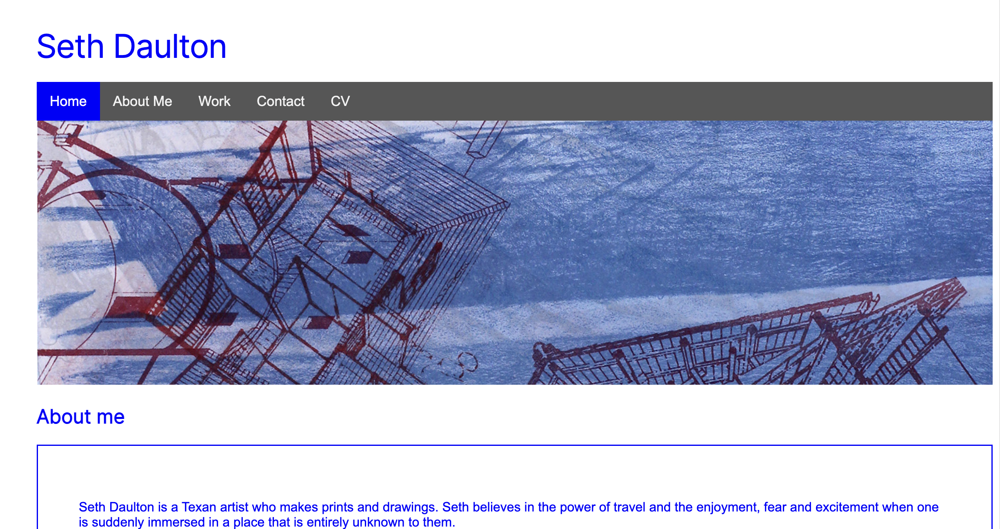

# Module-02-Challenge

## Description 

For this challenge I was tasked with building a portfolio page from scratch. This portfolio page will be used in the future to feature projects that I have completed for the University of Texas Coding Bootcamp. 

My portfolio page is divided up into several sections: "About Me", "Work", "Contact", and "CV". The user can access each section by using the navigation at the top of the page. I have set up anchors to jump to each section of the website. The portfolio page is responsive and adjusts to fit smaller and larger screens alike.

The images I have used for my "Work" section are just placeholders until I have executed more projects. 

## Screenshot

## Link to deployed page

Below is a link to the live Module 02 Challenge site:

https://sethdaulton.github.io/Module-02-Challenge/

